# Aktivitätsdiagramm der MQTT-Kommunikation – Bomb Defusal Parkour

Dieses Aktivitätsdiagramm modelliert den Kontroll- und Objektfluss der MQTT-Kommunikation zwischen dem **Dashboard**, dem **zentralen MQTT-Broker** und den **Stationen (Zellen 1 bis 6)**.

Die Modellierung folgt den Spezifikationen und Regeln für **UML 2.x Aktivitätsdiagramme** gemäß dem Leitfaden von [Sparx Systems Europe](https://www.sparxsystems.de/sprachen/uml/diagramme/aktivitaetsdiagramm/).

---

## Eingehaltene UML 2.x Regeln (Sparx Systems)

Gemäß der Spezifikation von Sparx Systems wurden folgende Modellierungsregeln umgesetzt:

1. **Aktionen vs. Aktivitäten:**
   * Die einzelnen elementaren Schritte sind als **Aktionen** (abgerundete Rechtecke) modelliert.
   * Die Gesamtheit des Prozesses stellt die **Aktivität** *„Bomb Defusal Parkour Spielrunde“* dar.
2. **Knoten-Semantik & Tokenkonzept:**
   * **Startknoten (Initial Node):** Erzeugt das initiale Kontrolltoken bei Spielstart (`((●))`).
   * **Aktivitätsendknoten (Activity Final Node):** Beendet die gesamte Aktivität nach Abschluss des Spiels (`((◎))`).
   * **Ablaufendknoten (Flow Final Node):** Beendet den nebenläufigen Pfad einer Station nach erfolgreicher Lösung (`((X))`), ohne den übergeordneten Prozess abzubrechen.
3. **Verzweigungen (Decision Nodes) & Wächterbedingungen (Guards):**
   * Jede Verzweigung ist explizit als Rautensymbol (**Decision Node**) modelliert.
   * Jede ausgehende Kante besitzt eine vollständige und disjunkte **Wächterbedingung in eckigen Klammern** (`[Guard]`), sodass zu jedem Zeitpunkt genau eine Kante feuert.
4. **Zusammenführen (Merge Nodes) – Vermeidung von Deadlocks:**
   * Gemäß Sparx Systems führt das Führen mehrerer Kanten direkt in eine Aktion zu einem *impliziten Join* (es wird gewartet, bis an allen Kanten gleichzeitig ein Token anliegt $\rightarrow$ Deadlock).
   * Daher werden alle alternativen Pfade und Rückführungen (Schleifen) explizit über ein Rautensymbol (**Merge Node**) zusammengeführt.
5. **Parallelisierung (Fork) & Synchronisation (Join):**
   * Ein **Fork Node** (Splitting-Knoten) dupliziert das Kontrolltoken für die 6 parallel laufenden Stationen.
   * Ein **Join Node** (Synchronisationsknoten) synchronisiert die parallelen Tokens, sobald alle 6 Stationen gelöst wurden.
6. **Verantwortlichkeitsbereiche (Swimlanes / Partitions):**
   * Drei vertikale Bahnen (Partitions) weisen die Verantwortlichkeiten den Akteuren zu:
     * **Dashboard (Koordinationsteam)**
     * **Zentraler MQTT Broker**
     * **Station $i$ (Zelle 1 bis 6)**
7. **Signal-Aktionen (Send Signal Action & Receive Signal Action):**
   * Da MQTT asynchron und entkoppelt arbeitet, wird das Publishen als **Send Signal Action** (`>"..."`]`) und das Empfangen/Subscriben als **Receive Signal Action** (`[/"..."/]`) modelliert.
8. **Objektfluss (Object Flow):**
   * Übergaben von Daten (z. B. Start-Ziffer und JSON-Statuspayloads) werden als Objektfluss über Kanten transportiert.

---

## Aktivitätsdiagramm

```mermaid
flowchart TD
    %% ==========================================
    %% SWIMLANE 1: DASHBOARD
    %% ==========================================
    subgraph D ["Partition: Dashboard (Koordinationsteam)"]
        D_Init((●))
        D_GenCode["Aktion: 6-stelligen Code generieren (1 Ziffer pro Station)"]
        D_Fork["━━━ Fork Node: Splitting (Parallelisierung auf 6 Stationen) ━━━"]
        D_SendStart>"Send Signal Action: parkour/station/id/start"]
        D_MergeLoop{"Merge Node"}
        D_WaitNext["Aktion: Auf Status-Updates warten"]
        D_RecStatus[/"Receive Signal Action: Status-Update empfangen"/]
        D_MergeProc{"Merge Node"}
        D_DecType{"Decision Node: Status-Typ?"}
        D_HandleIdle["Aktion: Station als 'bereit' markieren"]
        D_HandleActive["Aktion: Station als 'aktiv' markieren & Live-Timer starten"]
        D_HandleSolved["Aktion: Station als 'gelöst' markieren & in SQLite DB speichern"]
        D_DecAllSolved{"Decision Node: Alle Stationen gelöst?"}
        D_Join["━━━ Join Node: Synchronisation aller 6 Stationen ━━━"]
        D_InputCode["Aktion: 6-stelligen Code eingeben (Eingabe durch Spieler im UI)"]
        D_DecVerify{"Decision Node: Code-Prüfung"}
        D_Defused["Aktion: Erfolg anzeigen (Bombe erfolgreich entschärft)"]
        D_Exploded["Aktion: Explosion / Fehlschlag anzeigen (Falscher Code oder Zeit abgelaufen)"]
        D_MergeEnd{"Merge Node"}
        D_Final((◎))
    end

    %% ==========================================
    %% SWIMLANE 2: MQTT BROKER
    %% ==========================================
    subgraph B ["Partition: Zentraler MQTT Broker"]
        B_RecStart[/"Receive Signal Action: Start-Signal empfangen"/]
        B_RouteStart>"Send Signal Action: Start-Signal an Station weiterleiten"]
        
        B_RecStatus[/"Receive Signal Action: Status-Signal empfangen"/]
        B_RouteStatus>"Send Signal Action: Status an Dashboard weiterleiten"]
    end

    %% ==========================================
    %% SWIMLANE 3: STATION i (1 bis 6)
    %% ==========================================
    subgraph S ["Partition: Station i (Zellen 1 bis 6)"]
        S_RecStart[/"Receive Signal Action: parkour/station/id/start"/]
        S_Reset["Aktion: Zustand zurücksetzen & Ziffer im Speicher sichern"]
        S_SendIdle>"Send Signal Action: parkour/station/id/status (state: idle)"]
        S_WaitPlayer["Aktion: Auf Spieler-Interaktion warten"]
        S_PlayerStarts["Aktion: Erste Interaktion erfassen (timestamp_start = now)"]
        S_SendActive>"Send Signal Action: parkour/station/id/status (state: active)"]
        S_Solve["Aktion: Rätsel durchführen & lösen (timestamp_end = now)"]
        S_Rating["Aktion: Feedback erfassen (rating: green / yellow / red)"]
        S_ShowDigit["Aktion: Ziffer für Spieler auf Display anzeigen"]
        S_SendSolved>"Send Signal Action: parkour/station/id/status (state: solved)"]
        S_FlowFinal((X))
    end

    %% ==========================================
    %% KONTROLL- UND OBJEKTFLÜSSE
    %% ==========================================

    %% Initialisierung & Start
    D_Init --> D_GenCode
    D_GenCode --> D_Fork
    D_Fork --> D_SendStart
    D_Fork --> D_MergeLoop

    %% Start-Signal Übertragung
    D_SendStart -->|"Objektfluss: digit"| B_RecStart
    B_RecStart --> B_RouteStart
    B_RouteStart -->|"Objektfluss: digit"| S_RecStart

    %% Station: Idle
    S_RecStart --> S_Reset
    S_Reset --> S_SendIdle
    S_SendIdle -->|"Objektfluss: Status idle"| B_RecStatus

    %% Station: Active
    S_SendIdle --> S_WaitPlayer
    S_WaitPlayer --> S_PlayerStarts
    S_PlayerStarts --> S_SendActive
    S_SendActive -->|"Objektfluss: Status active"| B_RecStatus

    %% Station: Solved
    S_SendActive --> S_Solve
    S_Solve --> S_Rating
    S_Rating --> S_ShowDigit
    S_ShowDigit --> S_SendSolved
    S_SendSolved -->|"Objektfluss: Status solved"| B_RecStatus
    S_SendSolved --> S_FlowFinal

    %% Broker Weiterleitung an Dashboard
    B_RecStatus --> B_RouteStatus
    B_RouteStatus -->|"Objektfluss: Status-Payload"| D_RecStatus

    %% Dashboard Verarbeitung mit sauberen Merge Nodes
    D_MergeLoop --> D_WaitNext
    D_WaitNext --> D_RecStatus
    D_RecStatus --> D_DecType

    D_DecType -->|"[state == idle]"| D_HandleIdle
    D_DecType -->|"[state == active]"| D_HandleActive
    D_DecType -->|"[state == solved]"| D_HandleSolved

    D_HandleIdle --> D_MergeProc
    D_HandleActive --> D_MergeProc
    D_HandleSolved --> D_MergeProc

    D_MergeProc --> D_DecAllSolved
    D_DecAllSolved -->|"[Noch Stationen offen]"| D_MergeLoop
    D_DecAllSolved -->|"[Alle 6 Stationen gelöst]"| D_Join

    %% Spielabschluss
    D_Join --> D_InputCode
    D_InputCode --> D_DecVerify
    D_DecVerify -->|"[Code korrekt]"| D_Defused
    D_DecVerify -->|"[Code falsch oder Zeit abgelaufen]"| D_Exploded

    D_Defused --> D_MergeEnd
    D_Exploded --> D_MergeEnd
    D_MergeEnd --> D_Final
```

---

## Detaillierte Modellierungselemente

### 1. Knoten und Kanten

| UML-Element | Symbol im Diagramm | Bedeutung im Bomb-Defusal-Parkour |
|---|---|---|
| **Startknoten** | `((●))` | Beginn des Spiels nach Auslösen im Dashboard. |
| **Aktion** | `[...]` | Einzelschritt (z. B. Code generieren, Ziffer anzeigen, DB speichern). |
| **Send Signal Action** | `>"..."`]` | Asynchrones Senden einer MQTT-Nachricht (Publish). |
| **Receive Signal Action** | `[/"..."/]` | Asynchrones Empfangen einer MQTT-Nachricht (Subscribe / Inbound). |
| **Decision Node** | `{"..."}` | Bedingte Verzweigung mit disjunkten Guards (`[Guard]`). |
| **Merge Node** | `{"Merge Node"}` | Zusammenführen von Pfaden/Schleifen ohne Deadlock-Gefahr. |
| **Fork Node** | `━━━ Fork ━━━` | Nebenläufiges Aufteilen des Kontrollflusses auf die 6 Stationen. |
| **Join Node** | `━━━ Join ━━━` | Synchronisation aller 6 Stationen vor der finalen Code-Eingabe. |
| **Ablaufendknoten (Flow Final)** | `((X))` | Beendet den nebenläufigen Ablauf einer einzelnen Station (`state: solved`). |
| **Aktivitätsendknoten** | `((◎))` | Vollständiges Beenden des Spiels (Bombe entschärft oder detoniert). |

### 2. Disjunkte Wächterbedingungen (Guards)

Gemäß UML-Standard sind alle Entscheidungskanten mit vollständigen, sich nicht überlappenden Guards versehen:
* **Entscheidung `Status-Typ`:**
  * `[state == idle]`
  * `[state == active]`
  * `[state == solved]`
* **Entscheidung `Alle Stationen gelöst?`:**
  * `[Noch Stationen offen]` $\rightarrow$ Rückführung über Merge Node in den Wartezustand.
  * `[Alle 6 Stationen gelöst]` $\rightarrow$ Weiterleitung zur Synchronisation (Join Node).
* **Entscheidung `Code-Prüfung`:**
  * `[Code korrekt]` $\rightarrow$ Entschärft.
  * `[Code falsch oder Zeit abgelaufen]` $\rightarrow$ Explosion.
