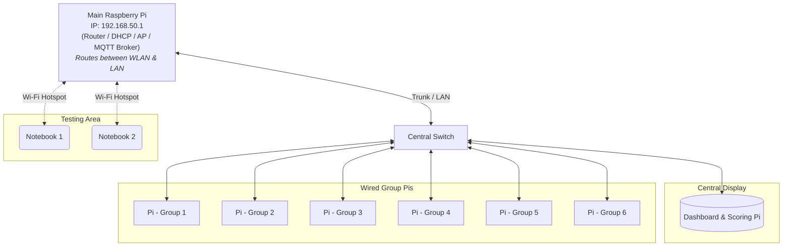

# Network Architecture Overview

This document outlines the standalone network infrastructure used for our group environment. The setup is entirely offline (air-gapped) and designed to allow seamless communication, including MQTT messaging, between wireless test devices and wired group hardware.

## Topology Diagram

## Core Components

* **Main Raspberry Pi (192.168.50.1):** The core of the network. It acts as the router, DHCP server, and Wi-Fi Access Point. Crucially, it hosts the central **MQTT Broker**, handling the telemetry and message exchange between all clients.
* **Central Switch:** The physical backbone of the local area network (LAN), distributing the wired connection from the Main Pi to the displays and all group devices.
* **Dashboard & Scoring Pi:** A dedicated wired Raspberry Pi that handles the visual output for the network, displaying the current dashboard and scoring board.
* **Group Pis (1-6):** The dedicated hardware nodes for the six project groups. They are connected via Ethernet to ensure stable data transmission (e.g., publishing MQTT payloads) to the Main Pi.
* **Test Notebooks:** Connected wirelessly to the Main Pi's hotspot. Used by developers and testers to access the network, monitor MQTT topics, or debug configurations without requiring physical cables.

## Routing and Communication

The network is completely independent and has no external internet connection. Full internal bi-directional communication is enabled. 

The Main Pi actively routes traffic between the wireless network (WLAN) and the wired network (LAN). Any test notebook connected to the Wi-Fi hotspot can directly ping the wired Group Pis, view the Dashboard Pi, and subscribe/publish to the central MQTT Broker hosted on the Main Pi.