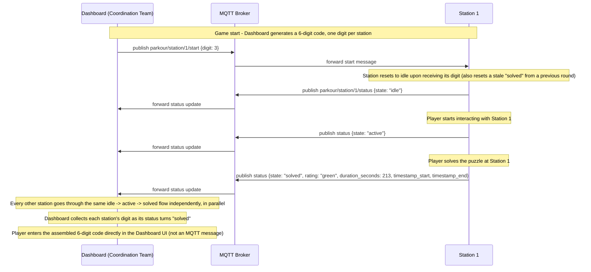

# MQTT Sequence Diagram - Bomb Defusal Parkour

Shows the message flow between the Coordination Team's dashboard, the MQTT broker, and a station, as defined in the [ICD](./ICD_Bomb_Defusal_Parkour.md). Only one station is shown as an example - the same flow repeats independently for all 6 stations, since they never communicate with each other directly (always via the broker).

